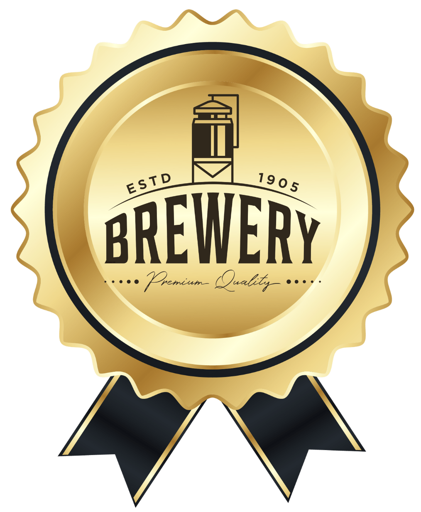
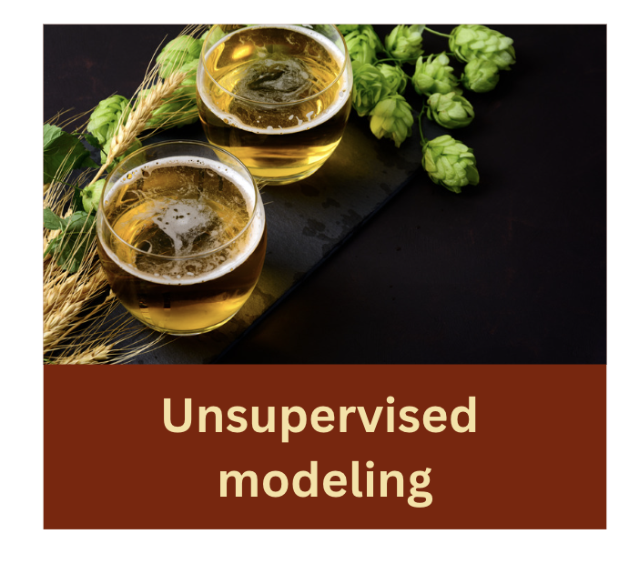
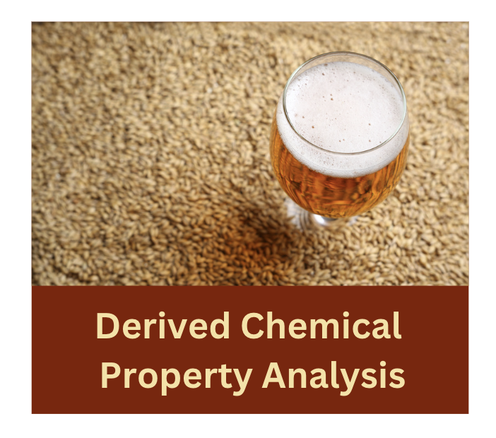
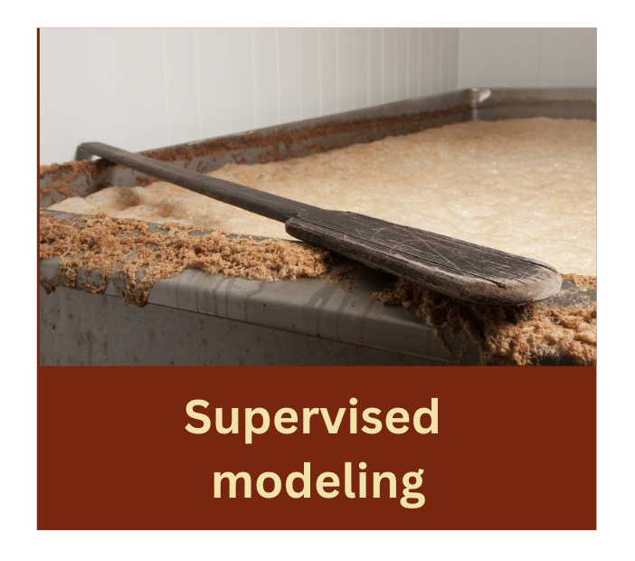

<div style="text-align: center;">
    
</div>

# Brewery Operations and Market Analysis Dataset

This project was completed as the final Phase 5, Capstone assessment in the Flatiron School’s Data Science Bootcamp. 

Analysis by Erin Wasserman, July 2024

# Overview

This dataset presents an extensive collection of data from a craft beer brewery, spanning from January 2020 to January 2024. It encapsulates a rich blend of brewing parameters, sales data, and quality assessments, providing a holistic view of the brewing process and its market implications.

# Business Problem

In the beer market, demand plays a key role in future industry dynamics. The introduction of new ingredients and innovative flavors into the beer market, combined with a business model that values consumer loyalty, will increase appeal among generations. 

The main goal of any brewery is to focus on producing high quality beer. **Quality beer is a key success factor.** The most important thing a brewery can do is keep producing quality beer to stay competitive. As the variety of beers on the market increases, low-quality beers will be eliminated first. 

1. Determine best malt and hops types for quality beer.
2. Assess malt-to-hops ratio impact on beer quality.
3. Evaluate ML accuracy in predicting beer characteristics.
4. Visualize beer styles based on quality ratings.

# Data Understanding

**Dataset Description**

[Kaggle Dataset](https://www.kaggle.com/datasets/ankurnapa/brewery-operations-and-market-analysis-dataset/data) <br>

Data Format and Structure:
-The dataset is structured in a tabular format, provided in a CSV file for easy integration with various data analysis tools.
-It comprises over 10 million records, each representing a unique batch with a comprehensive set of features.

Intended Audience:
This dataset is invaluable for data scientists, brewing process engineers, market analysts, supply chain experts, and quality control professionals in the brewing industry. It is also highly relevant for academic research in food technology, fermentation science, and business analytics.

Disclaimer:
-The data is synthetic and intended for educational, analytical, and simulation purposes.
-Users are advised to apply appropriate data processing and analysis techniques for meaningful insights.
-This comprehensive dataset serves as a rich resource for exploring the intricacies of brewing science, market dynamics, and operational efficiency in the craft beer industry.

**Highlighted Data Features**

Brewing Parameters: Includes crucial brewing factors such as fermentation time, temperature, pH level, gravity, and ingredient ratios. These parameters are pivotal in understanding the brewing process and its impact on the final product.

Beer Styles: The dataset categorizes beers into various styles like IPA, Stout, Lager, etc.

Quality Scores: Each batch is rated for its quality on a scale, offering insights into the success and consistency of different brewing approaches.

Application:
Brewing Process Optimization: Ideal for analysis aiming to correlate brewing techniques with beer quality, facilitating the optimization of brewing conditions for superior product quality.

**Data Splits**

-Use the following code to create a reproducible subset of the larger [Kaggle Dataset](https://www.kaggle.com/datasets/ankurnapa/brewery-operations-and-market-analysis-dataset/data) <br>

- The dataset was randomly split into training (80%) and test (20%) sets to evaluate model performance.

**Data Licensing and Usage**

# Methodology
<span>
    
<span style="font-size: 2em; font-weight: bold; vertical-align: middle;"><span>
    <span>
    
</span> 
</span> </span>

## Data Preparation

**Data Cleaning and Preprocessing**

1. Correlation Plots
2. Pair plots

## Modeling

1. K-Means Clustering
2. Random Forest 
3. Gradient Boosted Decision Tree

## Evaluation

1. Inertia Score
2. Silhouette Score
3. R^2 Score

## Limitations

1. Computational Bottlenecks <br>
    - Despite the completeness of the dataset, the sheer size of 10 million data points likely caused significant computational bottlenecks, limiting the depth and breadth of this analysis.
2. Underutilization of Data <br>
    - Due to resource constraints, not all data could be effectively utilized, potentially leading to incomplete insights.
3. Sampling Bias<br>
    - Only a subset of data was analyzed due to resource limits, this introduced sampling bias, affecting the representativeness of these results.
4. Reduced Feature Engineering <br>
    - Limited computational resources constrained the ability to explore and engineer additional features that could improve model performance.

# Key Findings
<ol>
  <li><strong>
K-Means Clustering</strong></ol>

Evaluation Metrics:
<ul>
<li>Inertia Score: 19196114.00
<li>Silhouette Score: 0.2700
</ul>

Observation (Inertia Score): High inertia score indicates that the clusters are not well-separated, suggesting that the data points within clusters are relatively far from their centroids.

Observation: (Silhouette) A silhouette score of 0.2700 suggests that the clustering may not be well-defined, indicating some overlap between clusters and potential room for improvement in feature selection or clustering parameters.

<ol start ="2">
<li><strong>
Random Forest</strong>
</ol>

Evaluation Metrics:
<ul>
<li>R^2 Score: 1.7314027253467756e-05
</ul>

Observation: The very low R² score suggests poor predictive power, indicating that the model is not capturing the variance in the data well. The feature importance analysis highlights critical factors, but the overall model performance needs further tuning.

<ol start ="3">
<li><strong>
Gradient Boosted</strong>
</ol>

Evaluation Metrics:
<ul> 
<li>R^2 Score: 6.48369635813939e-06
</ul>

Observation: Similar to Random Forest, the low R² score indicates that the model is not effectively predicting beer quality. The critical features identified provide valuable insights, but further model refinement and feature engineering are necessary.

<u>Additional Plots:</u><br>
<ol start ="4">
<li><strong>
Hexbin Plots</strong>
</ol>

Observation: The Malt-to-Hops ratio shows little correlation with quality scores, suggesting that other factors may play a more significant role in determining quality. This warrants further investigation into other feature combinations.

<ol start ="5">
<li><strong>
Box and Violin Plots</strong>
</ol>

Observation: Consistent median fermentation times across beer styles suggest standardization in the brewing process, while the presence of outliers indicates specific conditions or variations that may impact quality. Exploring these outliers could reveal insights into optimizing the brewing process.
## Actionable Insights

1. Refine Malt-to-Hops ratios.

2. Validate machine learning models.

3. Leverage clustering for beer style differentiation.

4. Analyze malt and hops types combinations.

## Next Steps

These steps aim to address the core issues of resource constraints and dataset size, helping to continue this analysis more efficiently and effectively in the next phase of this project.
<ol>
<li>Optimize Resource Allocation:

- Explore using specialized cloud services like Google Cloud Dataproc for large-scale Spark jobs.
- Consider AWS Sagemaker for model training to take advantage of managed machine learning services.
- Investigate high-performance computing (HPC) clusters or collaborate with research institutions for advanced computational resources.

<li>Leverage Spark:

- Continue refining Apache Spark for in-memory processing and distributed computation.
- Focus on reducing dependency on Pandas to improve processing speed and efficiency.

<li>Expand Feature Engineering:

- Generate a diverse array of features within Spark.
- Aim to maximize dataset utility and model accuracy without the need for data format conversion.

<li>Plan for Scalability:

- Design all solutions with scalability in mind.
- Prepare to accommodate future expansions in dataset size and analysis complexity.<br><br>

# Author

Name: Erin Wasserman

GitHub: [Cellister](https://github.com/cellister)

Email address: cellister at gmail .com

# Repository Structure
<br>

* **Notebook**

The [Google Colab Notebook](https://github.com/cellister/Automated_Essay_Scoring/blob/main/automated_essay_scoring_06_18.ipynb), is the key deliverable and contains the details of my data strategy, methodology, data cleaning, visualizations, and actionable insights. [notebook PDF](https://github.com/cellister/Automated_Essay_Scoring/blob/main/Project_PDFs/automated_essay_scoring_notebook.pdf)

* **Presentation**

This 5-7 minute, non-technical [presentation PDF](https://github.com/cellister/Automated_Essay_Scoring/blob/main/Project_PDFs/automated_essay_scoring_presentation.pdf) was made in [Canva](https://www.canva.com/design/DAGLjNp34do/PpyjXviTJ2iyF8SPuVBttA/edit?utm_content=DAGLjNp34do&utm_campaign=designshare&utm_medium=link2&utm_source=sharebutton) and gives an impactful and brief overview of the key insights and recommendations. 

* **Data**

The data used in this analysis can be found in the [Kaggle Dataset](https://www.kaggle.com/datasets/ankurnapa/brewery-operations-and-market-analysis-dataset/data).

```

├── Images
│   ├── Unsupervised
│   ├── Supervised
│   ├── Chemistry_analysis
│   ├── General
├── Development_notebooks
├── Project_PDFs
│   ├── Brewing_Chemistry_presentation.pdf
│   ├── Brewing_Chemistry_notebook.pdf
│   └── Brewing_Chemistry_github_repository.pdf
├── .gitignore
├── Brewing_Chemistry_XX.ipynb
└── README.md
```


